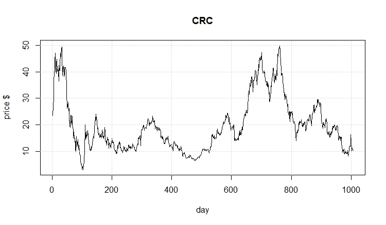

# Introduction
This is an implementation of a support vector machine designed to identify short-term stock price changes, based on previous stock parameters: open, low, high, close, volume

## Stock selected for this exercise:

<!-- put your justification/choice here: !-->


```{r setup, echo=FALSE, include=FALSE}
knitr::opts_chunk$set(echo = TRUE)
library(e1071)
```

## get data:

```{r}
crcData = read.csv('CRC.csv')
attach(crcData)
# set up data frame
crcDataFrame = data.frame(open=price.open, high=price.high,
        low=price.low, close=price.adjusted,volume= volume/10000,oil=oil.price,change = direction)
head(crcDataFrame)
tail(crcDataFrame)
remove(crcData)

```

```{r}
levels(direction)
plot(crcDataFrame)
```
model_test <- svm(x, y)


## classification model, categorical response

### traditional interface:
```{r}
x <- subset(crcDataFrame[1:231,], select = -change)
y <- crcDataFrame[1:231,]$change

model_test<- svm(x,y) 

print(model_test)
summary(model_test)
```


## how well did the model fit?

```{r}
pred <- predict(model_test, x)

# Check accuracy:
table(pred, y)


```

## decision values

```{r}
# compute decision values and probabilities:
pred <- predict(model_test, x, decision.values = TRUE)
attr(pred, "decision.values")[1:7,]

# visualize (classes by color, SV by crosses):
plot(cmdscale(dist(crcDataFrame[,-7])),
     col = as.integer(crcDataFrame[,7]),xlab="normalized X", ylab = "$ change",
     pch = c("o","+")[1:200 %in% model_test$index + 1])
legend('bottomleft',c('data','prediction'),pch=c('0','+'))
grid()


     
```


# train and test set:

```{r}
pctTrain=0.66
#nObs = length(x[,1])
nObs=231
nTrain = round(pctTrain*nObs,0)
TrainSetIndex = 1:nTrain


# or ?
#scramble=sample(1:nObs)
#TrainSetIndex=scramble[1:nTrain]
#TestSetIndex= scramble[(nTrain+1):nObs]
```

## set up training set, test set

```{r}
# first the training set

XtrainSet = crcDataFrame[TrainSetIndex,-7]
YtrainSet = crcDataFrame$change[TrainSetIndex]
```

## get the model from training set.. 

```{r}
model_train<- svm(XtrainSet, YtrainSet) 
print(model_train)
summary(model_train)
```

## now the test set.. 

```{r}
XtestSet = crcDataFrame[(nTrain:nObs),-7]
YtestSet = crcDataFrame$change[nTrain:nObs]
```

## and evaluate with the test data

```{r}
pred2 <- predict(model_train, XtestSet)
# And the accuracy..

table(pred2, YtestSet)
```

## tune

```{r}
stockTuned <- tune.svm(XtrainSet, YtrainSet, gamma = 2^(-1:1), cost = 2^(-1:6))

summary(stockTuned)
plot(stockTuned)
```

```{r}
#use optimized parameters... 
model_tuned <- svm(XtrainSet, YtrainSet, gamma=0.5, cost=2) 

print(model_tuned)
summary(model_tuned)
```

```{r}
pred3 <- predict(model_tuned, XtestSet)
# And the accuracy..

table(pred3, YtestSet)

```

```{r}
pred= predict(model_tuned,XtestSet,decision.values = TRUE)
attr(pred,"decision.values")[1:20,]
```

```{r}
plot(cmdscale(dist(XtestSet)),
     col = as.integer(YtestSet),xlab="normalized X", ylab = "$ change",
     pch = c("o","+")[1:200 %in% model_tuned$index + 1],xlim = c(-200,500))
legend('bottomright',c('data','prediction'),pch=c('0','+'))
grid()
```


```{r}
XtrainSet2 = crcDataFrame[232:247,-7]
YtrainSet2=crcDataFrame$change[232:247]


pred4 <- predict(model_tuned, XtrainSet2)

table(pred4,YtrainSet2)


```

#SVM Assignment

## complete an rmarkdown file on the stock you selected.   
  You will turn in the URL for your github accout that has the repo for this assignment.

### Identify the stock you use for this assignment.  
Why did you choose this particular stock?  
  
  I chose the California Resources Stock becaused fo the variability from day to day. It has also seen pretty steep rises and falls over the last year. 

```{r Insert Picture in document, fig.cap="caption"}

```


<!--   Include in your final report a graph of the stock closing price over the period 20 Jan 2018 to 13 Sept 2019.  Include the .csv file in your repo for the stock you selected.  !-->

### Use this template to get the SVM:  
1. Training and Test sets:  

 I chose to use chronological data observations. I believe that because the stock I chose is of an energy company, that some trends could be market related or seasonal. I used 2/3 of my data set to train the SVM. I chose something large enough to include steep climbs and drops.
  
<!--    What percent of the stock data did you use for the training set?  How did you select the training set size?  


    Did you select the training set to be the chronological first data observations, and the test set to be the following observations, or did you choose to randomly sample the stock data to get the training set and use the remaining observations for the test set?  Justification for your choice? !-->  
    
   

    
2. How well did the SVM do?:
  
  The SVM did not do as well as I hoped it would. The the predictions for the whole data set were only correct in predicting an increase in stock price 35% of the time, and predicted a decrease in stock price correctly only 61% of the time. The predictions using only the test set only predicted increases correctly 54% of the time and decreases only 36% of the time.
  
<!--  show the table of predicted vs truth for the whole data set, and then the same table for predicted vs actual results for just the test set.  !-->

 
```{r}
table(pred2, YtestSet)
```
<!--3. Tune the algorithm- i.e. find optimal gamma and cost values.  <!--Use these valuse to recompute the table of predicted vs actual results for the test set. !-->

After the model was tuned using a gamma of 1 and cost of 0.5, the model predicted an increase in price only 40% of the time and decreases only 63% of the time. 


```{r}
table(pred3, YtestSet)
```


### Evaluate SVM performance     

  1. Did you exmine using other than the 'open', 'low', 'high', 'close' prices and volume as predictors? 
  
  I include oil price in my model. Since, CRC is an oil and gas company I figured that oil price could have a significant influence on the stock price.
  
<!-- do you have any evidence that some particular set of the explanatory variables can improove predictions? !-->
  
  2. Use the SVM you developed to predict stock moves on 16 - 20 Sept. 2019.  Compute the ROI assuming the SVM identifies an opportunity, (for example use around $1000 on each of the SVM predictions)

```{r}
table(pred4,YtrainSet2)
```
 I tested the model with the last two weeks of data, so from 9/13/2019 to 10/7/2019. The model correctly predicted a decrease in stock price 92% of the time. It didn't predict anything else right.
  
<!-- There are 5 days available for prediction; if the daily prediction was 'U' buy the stock, then cash out when/if price increases within 5 days. If the daily predictions is 'D', sell the shock short and cash out within 5 days.  If the prediction is E, no investment.  Include your ROI results !-->  

3.  Would you put your own $$ in this SVM?  

  I would not invest my own money in this SVM. The predictions in increase are not correct enough of the time for me to make any money.Since I do not have CRC stock at the moment, so shorting the stock could possible go better than purchasing stock, but it is still to big a risk for me to invest using the SVM.
    
  